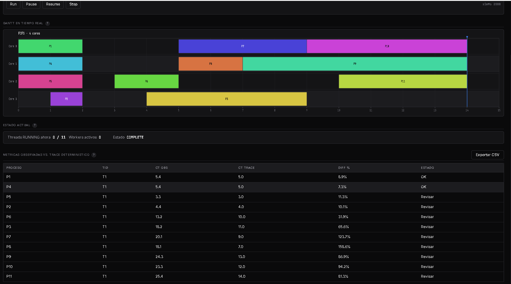
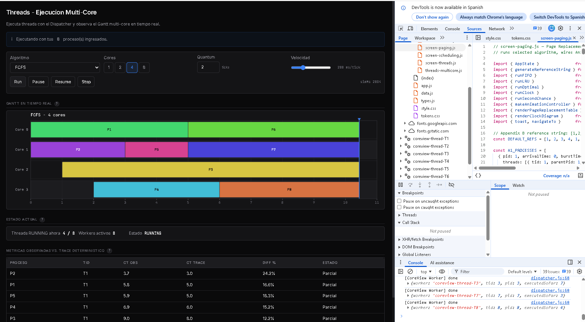
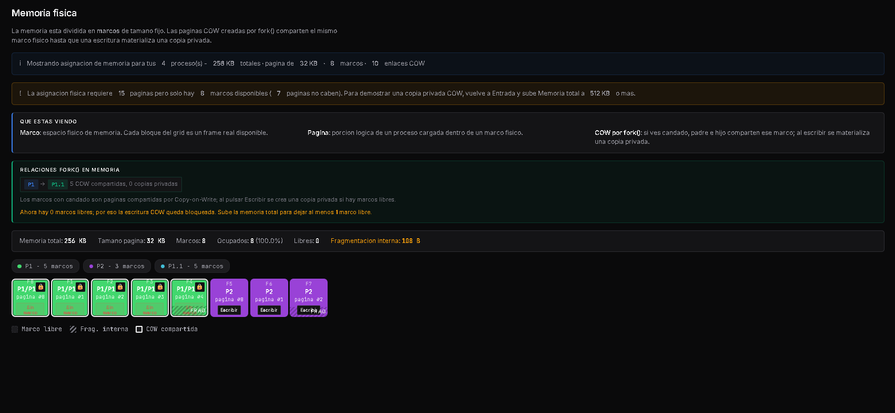

# CoreView

Simulador de planificacion de procesos (scheduling) y paginacion de memoria para sistemas operativos.

## Descripcion

CoreView es una aplicacion web educativa que permite visualizar y comparar distintos algoritmos de planificacion de CPU y de reemplazo de paginas en memoria. Esta hecha con HTML, CSS y JavaScript puro (sin frameworks) y usa ES modules.

## Vista previa

### Threads ejecutando en paralelo — 4 cores activos


### Web Workers reales visibles en DevTools


### Fork y Copy-on-Write en pantalla de Memoria


## Algoritmos incluidos

### Planificacion de procesos
- FCFS (First Come First Served)
- SJF (Shortest Job First)
- SRTF (Shortest Remaining Time First)
- Priority (con y sin expropiacion)
- Round Robin
- HRRN (Highest Response Ratio Next)
- MLQ (Multilevel Queue)
- MLFQ (Multilevel Feedback Queue)

### Paginacion de memoria
- FIFO
- LRU (Least Recently Used)
- Optimal
- Second Chance
- Clock

## Carga de procesos desde archivo .txt

CoreView puede importar configuraciones de procesos desde archivos de texto plano. La validación se hace con expresiones regulares que cubren cuatro tipos de campo distintos (PIDs, tiempos, prioridades y conteos de páginas).

### Formato 5 columnas (procesos de un solo thread)

```
pid,arrival,burst,priority,sharedPages
1,0,5,2,1
2,1,3,1,1
3,2,7,3,2
```

### Formato 9 columnas (procesos multi-thread)

```
pid,arrival,procBurst,priority,sharedPages,numThreads,threadArrival,threadBurst,stackPages
1,0,8,2,1,2,0,5,1
1,0,8,2,1,2,0,3,1
```

Cuando un proceso tiene N threads, aparecen N líneas con el mismo PID y distintos valores de threadArrival/threadBurst.

### Validación con expresiones regulares

Cada campo se valida contra una regex específica antes del parseo:

| Campo | Regex | Rango aceptado |
|---|---|---|
| PID, TID | `/^[1-9]\d*$/` | enteros positivos |
| Arrival, burst | `/^\d+$/` | enteros no negativos |
| Priority | `/^[1-9]$/` | 1 a 9 |
| sharedPages, stackPages | `/^[1-9]\d*$/` | enteros positivos |

Si el archivo tiene errores de formato, el simulador reporta línea por línea qué campo falló y qué tipo se esperaba. Ver `samples/sample-malformado.txt` para ejemplos.

### Cargar múltiples archivos

El botón "Cargar otro archivo" acumula procesos sin reemplazar los anteriores. Cada proceso aparece en la lista con animación incremental.

### Archivos de muestra

La carpeta `samples/` incluye:

- `sample-5col-basic.txt` — 3 procesos simples
- `sample-5col-busy.txt` — 8 procesos para probar scheduling con carga
- `sample-9col-multithread.txt` — procesos con varios threads
- `sample-malformado.txt` — mezcla válido/inválido para probar regex
- `sample-grande.txt` — 30 procesos para stress test

## Exportacion de resultados a CSV

Después de ejecutar cualquier algoritmo, las pantallas Scheduling, Threads y Comparison incluyen un botón "Exportar CSV" que descarga los resultados.

El CSV incluye:

- Headers con todas las métricas (PID, TID, Arrival, Burst, Completion, Turnaround, Waiting, Response)
- Una fila por thread/proceso
- Metadata al final: algoritmo usado, número de cores, promedios, timestamp de generación

Ejemplo de salida:

```
PID,TID,Arrival,Burst,Completion,Turnaround,Waiting,Response
1,1,0,5,5,5,0,0
2,2,1,3,8,7,4,4
...
Algorithm,FCFS
Cores,2
Avg Turnaround,4.50
Avg Waiting,2.25
Generated,2026-05-09T17:30:00Z
```

La pantalla Comparison exporta un CSV con métricas de varios algoritmos en columnas paralelas, útil para análisis comparativo en Excel.

## Como ejecutar

IMPORTANTE: este proyecto usa ES modules (`type="module"`), por lo que NO funciona si se abre el archivo `index.html` directamente con doble clic en el navegador. Se debe servir desde un servidor web local, de lo contrario el navegador bloqueara la carga de los modulos por las reglas de CORS.

### Opciones para levantar un servidor local

Desde la carpeta del proyecto, puedes usar cualquiera de estas opciones:

Con Python 3:
```
python -m http.server 8000
```

Con Node (npx):
```
npx serve
```

Con la extension Live Server de VS Code: clic derecho sobre `index.html` y seleccionar "Open with Live Server".

Despues abrir en el navegador:
```
http://localhost:8000
```

## Como ejecutar las pruebas

Las pruebas estan escritas en JavaScript puro y se corren con Node:

```
node tests/test-data.js
node tests/test-scheduling.js
node tests/test-paging.js
node tests/test-threads.js
node tests/integration/threads-execution.test.js
```

Suite completa: 1601 tests pasando.

## Estructura del proyecto

```
CoreView/
  index.html              Pagina principal
  app.js                  Punto de entrada de la aplicacion
  data.js                 Estado, parseo y validacion regex
  types.js                Definiciones de tipos (JSDoc)
  style.css               Estilos
  engine/                 Logica pura de los algoritmos
    dispatcher.js         Orquestador de Workers multi-core
    thread-worker.js      Codigo ejecutado dentro de cada Worker
    csv-export.js         Generacion de CSV de resultados
    process-model.js      Modelo de procesos con fork simulado
    scheduling-*.js       Algoritmos de scheduling
    paging-*.js           Algoritmos de paginacion
  render/                 Dibujado en Canvas y DOM
  screens/                Pantallas de la interfaz
  samples/                Archivos de muestra para carga
  tests/                  Pruebas unitarias e integracion
  docs/                   Reporte tecnico y guia de defensa

```

## Arquitectura

El proyecto sigue una separacion en tres capas:

1. Capa de datos (`data.js`): mantiene el estado de la aplicacion, parseo de archivos y validación con expresiones regulares.
2. Capa de motor (`engine/`): funciones puras que ejecutan los algoritmos. No tocan el DOM y se pueden probar en Node.
3. Capa de renderizado (`render/`): consume las trazas generadas por el motor y las dibuja en pantalla.

### Threads, Fork y Multi-Core

CoreView implementa paralelismo real mediante Web Workers. La pantalla Threads instancia un Web Worker dedicado por cada thread schedulable. Estos Workers son hilos de ejecución del runtime de JavaScript que el navegador asigna a hilos del sistema operativo subyacente, ejecutándose en paralelo cuando hay múltiples núcleos físicos disponibles.

El simulador soporta 1, 2, 4 u 8 cores configurables por el usuario. Un componente `Dispatcher` orquesta la asignación de Workers a cores según el algoritmo de scheduling seleccionado. La política de scheduling es decidida por el algoritmo (FCFS, SJF, RR, etc.), no por el navegador — esta separación es deliberada porque el propósito educativo del simulador es visualizar y comparar políticas de scheduling.

Los Workers activos pueden verificarse en tiempo real:

- En la pantalla Threads, indicador "Workers activos"
- En DevTools del navegador → Sources → panel Threads
- En DevTools → Performance durante la ejecución

Fork se simula mediante `simulatedFork(parentPid)`: crea un proceso hijo con PID nuevo, atributos heredados del padre y todas las páginas marcadas como copy-on-write. La pantalla Memory muestra páginas COW con indicador visual; cuando se escribe sobre una página compartida, se materializa una copia visible en pantalla.

### Limitaciones declaradas

- MLQ y MLFQ se ejecutan single-core por diseño. La coordinación de queues múltiples entre cores está fuera del alcance educativo de esta entrega.
- COW es una simulación visual y no altera las métricas de scheduling.
- Fork está documentado como simulación en `engine/process-model.js` porque el entorno browser no permite invocar la syscall real.

### Modo Python (Bloqueo GIL)

La pantalla **Multi-Core Threads** compara dos entornos de ejecucion para threads CPU-bound:

- **JavaScript (Web Workers):** CoreView usa Web Workers y el `Dispatcher` puede asignar varios threads a varios cores en el mismo tick. No es ejecucion en C; el paralelismo real mostrado viene de Workers del navegador.
- **Python (Bloqueo GIL):** simula el Global Interpreter Lock de CPython para bytecode Python CPU-bound. Aunque existan varios cores, solo un thread avanza bytecode por tick y el token GIL rota cada 5 ticks por defecto.

Precision importante: CPython puede liberar el GIL durante I/O, y Python tambien puede usar varios cores con multiprocessing, extensiones nativas o workers/procesos separados. El modelo GIL de CoreView se limita a threads CPU-bound para mostrar por que el uso total queda cerca de `1 / numCores` en ese caso.

Reporte tecnico completo:

```
docs/reporte-tecnico.md
```

Guia de defensa y captura de Workers:

```
docs/defensa-threads.md
```

## Despliegue

La aplicacion esta pensada para correr en `ubiquitous.udem.edu`. No requiere paso de build ni bundler, solo se sirven los archivos estaticos. Se usan rutas relativas para que funcione desde cualquier subdirectorio del servidor.

Para Web Workers, el servidor debe servir `.js` con MIME JavaScript (`application/javascript` o `text/javascript`). En Apache, si hace falta:

```
AddType application/javascript .js
AddType text/css .css
```

## Requisitos

- Navegador moderno con soporte de ES modules y Canvas 2D.
- Node.js (solo para correr las pruebas).
- Un servidor web local para abrir la aplicacion (ver seccion "Como ejecutar").
